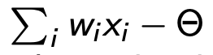

# One-Layer Neural Network as a multi-class Classifier

## Limitations of a single perceptron
- Single perceptron can be used as a classifier for maximum of 2 different classes
- Even for 2 classes there are cases that cannot be solved by a single perceptron
- In particular, only linearly separable regions in the attribute space can be distinguished

## Activation function of a neuron
The value of "activation": 
also called "net" value, is used as the argument in the activation function that decides the final output of the neuron  
There are many choices:
- Concerning the neuron's output type:
  - discrete (integer): it can be used for classification
  - continuous (floating point number): it can be used for regression or classification to
- Concerning the maximum (activation state) and minimum (non-activation state) values:
  - unipolar (discrete: {0, 1}, continuous: [0, 1])
  - bipolar (discrete: {-1, 1}, continuous: [-1, 1])
- Concerning the "shape" of the activation function (step, linear, sigmoidal, etc.)

## Examples of most important Activation Functions
Assume X is the input vector, denote net = Ei (wi*xi) - threshold (y is the input of neuron)  
The most commonly used activation functions:
- sign function: y = signum(net)
- "step" function: y = [x > 0]
- sigmoid function: y = 1 / (1 + e^-net)
- linear function ("raw" output): y = net

## The sigmoid function
- Unipolar variant: y = 1 / (1 + e^-net)
- Bipolar variant: y = 2 / (1 + e^-net) - 1

The function may have "steepness" parameter λ∈(0,∞):  
**y = 1 / (1 + e^(-λ*net)** (the higher the value of λ the "steeper" the function's graph)  
The sigmoid function has some important properties:
- is continuous and increasing
- "amplification" property
- has derivative and its derivative has a particularly convenient form (expressible in the terms of the function itself). This special property is very important for the back-propagation (BP) learning algorithm for multi-layer neural networks

## Multi-class classifier: one-layer NN
- Each single perceptron can distinguish max. of 2 classes
- In case of more than 2 classes, a layer of perceptrons can be used
- Typical architecture is as follows:
  - each input is connected to each perceptron
  - outputs of particular perceptrons are combined into the aggregated output of the network

## Interpreting the output of multi-neuron network
- 2-class classifier consisting of a single perceptron has one output that could be easily interpreted:
  - maximum activation means: "class 1"
  - minimum activation means: "class 2"
- In case of a multi-class classifier in the form of a layer of neurons, the network has multiple outputs. There are the following ways for representing the class decision in such case:
  - local
  - global

## "Local" representation of the output
- The number of perceptrons is the same as the number of classes.
- Each perceptron is trained to activate for exactly one class
- The "correct" output of such a network is: one perceptron is activated (what indicates the classification decision), other perceptrons are not activated

## "Global" representation of the output
- There is no rule for the number of perceptrons (but is usually smaller than in the "local" one)
- The classification decision of the network is derived from the outputs of all perceptrons
- Remark on the number of perceptrons in global architecture: since each separate perceptron can output 2 different values, the minimal number of perceptrons to deal with K categories is log2K
- Usually the local representation is preferred to the global one as it is easier to train (in most cases) and simpler to interpret

## Continuous neurons used for classification
- Instead of using a layer of discrete neurons with local representation for the classification task, continuous neurons can be used too
- The most common approach is to, similarly as in the discrete case:
  - each continuous neuron is trained to maximally activate for "its" class
  - the **maximum selector** is used to select the category decision
- Such approach is more robust than the discrete, local, since (almost) any output can be interpreted
